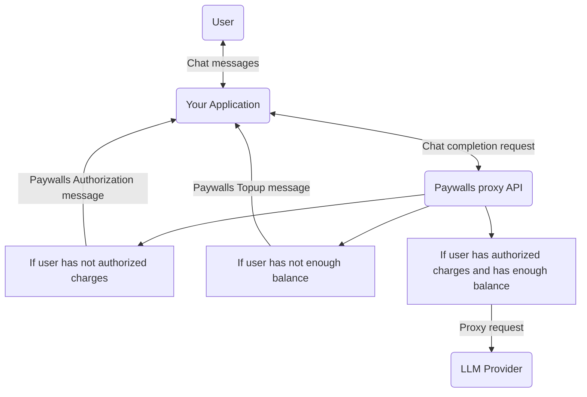

## 1. What is [Paywalls.ai](http://Paywalls.ai)?

[Paywalls.ai](http://Paywalls.ai) is a **programmable paywall and usage-based billing proxy** for OpenAI-compatible APIs.\
It lets you monetize any LLM without changing your frontend code — simply route your API requests through [Paywalls.ai](http://Paywalls.ai) instead of calling the model provider directly.

<Info>
  **OpenAPI spec:** https://api.paywalls.ai/v1/openapi.yml
</Info>

## 2. Create Your Account & API Key

1. Sign up at [Paywalls.ai Dashboard](https://dashboard.paywalls.ai)
2. Create a **Paywall** in the dashboard
3. Copy your **API Key** (you’ll use this in the `Authorization` header)

## 3. Point Your App to the Proxy

Replace your OpenAI endpoint and key with the [Paywalls.ai](http://Paywalls.ai) endpoint and your API key.

\*\*Example (Node.js with \*\*`openai`**npm package):**

```javascript
import OpenAI from "openai";

const client = new OpenAI({
  apiKey: "sk-paywalls-xxxxxxxx",
  baseURL: "https://api.paywalls.ai/v1"
});

const completion = await client.chat.completions.create({
  model: "gpt-3.5-turbo",
  messages: [{ role: "user", content: "Hello world" }],
  user: "user_123" // or pass via X-Paywall-User header
});

console.log(completion.choices[0].message.content);
```

<Note>
  **Note:** You can pass the user ID in the request body (`user` property) or in an `X-Paywall-User` header. [Learn more about User Identification](/paywall/user-identity).
</Note>

## 4. How It Works (In Short)

1. **Proxy receives your request**\
   Identifies the user and checks their paywall connection and balance.
2. **If not connected** → returns a `connect` link\
   **If balance too low** → returns a `topup` link
3. **If authorized** → forwards the request to the LLM provider
4. **Bills in real time** based on actual usage (tokens, per-request fees, or both)



## 5. Billing Options

You can configure each paywall or model to bill by:

- **Per request** — fixed price per API call
- **Per token** — based on measured prompt & completion tokens
- **Manual charges** — via `/user/charge`
- **Subscriptions** — handled externally or via custom logic

## 6. Benefits

- **Drop-in compatible** with the OpenAI API
- No custom billing or metering code required
- Works with any frontend/backend stack
- Supports pay-per-message, microtransactions, and token quotas
- Use with **code** or **no-code** tools (Zapier, n8n, Flowise, etc.)